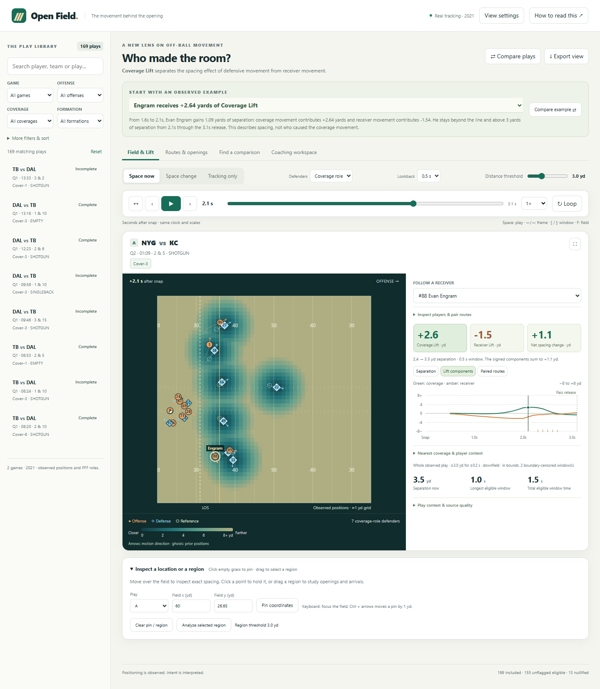

# Open Field

Open Field is a coaching tool built around **Coverage Lift**, an experimental signed-yard metric that separates the geometric contribution of defensive movement from receiver movement to a change in separation.
Coaches, scouts, and broadcasters can replay tracking, inspect the four-distance calculation, compare routes and plays, and investigate where defenders vacated space before a receiver arrived.
The verified demonstration shows Evan Engram gaining 1.09 yards of separation from a +2.64-yard defensive contribution and a −1.54-yard receiver contribution, contrasted with a Tyreek Hill opening driven mainly by receiver movement.
The offline package includes 321 plays across four 2021 games in two packs, annotated exports, reproducible Python and browser checks, and explicit limits: Coverage Lift measures geometry, not causal decoy credit, catch probability, or proven coaching usefulness.
Run `python app.py` with Python 3.10 or newer, or export a portable app with `python app.py --export submission/Open-Field.html`; [the guide](GUIDE.md), [metric definition](docs/METRIC.md), and [validation record](VALIDATION.md) explain the data, controls, and evidence.

